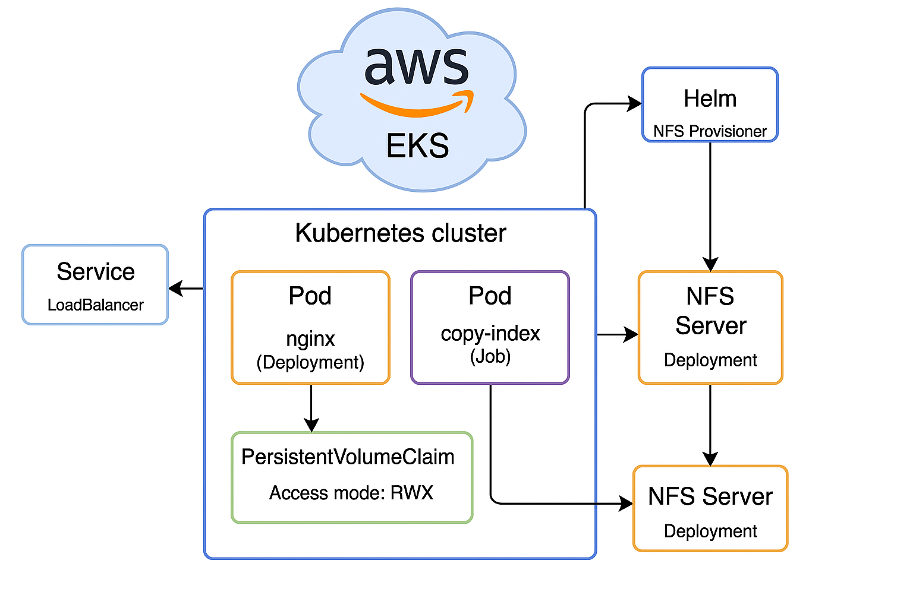

# Lab 6 – Kubernetes + NFS on AWS EKS

## 📦 Components

- **Amazon EKS** – managed Kubernetes cluster
- **Helm** – package manager for Kubernetes
- **NFS server** – internal pod that exports a shared folder
- **NFS Subdir External Provisioner** – Helm chart for dynamic provisioning
- **PersistentVolumeClaim (PVC)** – storage mounted by pods
- **Job** – writes sample `index.html` file
- **nginx Deployment** – serves web content from the PVC
- **LoadBalancer Service** – exposes nginx to the internet

---

## 🚀 How to Deploy

### 0. Create EKS cluster

### 1. Update kubeconfig
```bash
aws eks --region us-east-1 update-kubeconfig --name <cluster-name>
```

### 2. Deploy NFS server
```bash
kubectl apply -f nfs-server.yaml
```

### 3. Install Helm chart for NFS provisioner
```bash
helm repo add nfs-subdir-external-provisioner https://kubernetes-sigs.github.io/nfs-subdir-external-provisioner/
helm repo update
helm install nfs-provisioner nfs-subdir-external-provisioner/nfs-subdir-external-provisioner -f nfs.yaml
```

### 4. Create Persistent Volume Claim
```bash
kubectl apply -f pvc.yaml
```

### 5. Create a Job that writes index.html
```bash
kubectl apply -f job.yaml
```

### 6. Deploy nginx that serves HTML from PVC
```bash
kubectl apply -f deployment.yaml
```

### 7. Expose nginx using LoadBalancer
```bash
kubectl apply -f service.yaml
```

### 8. Open in browser
```bash
kubectl get svc nginx-service
```
Copy the `EXTERNAL-IP` and open it in your browser.

---

## 🖼️ Screenshot


## Architekture

